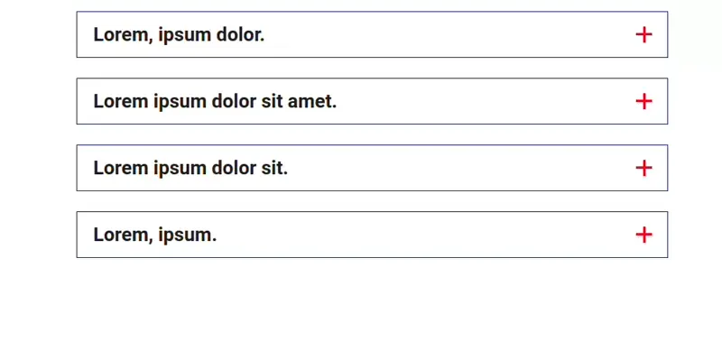

# Accordeon 1



## Código PHP / TWIG
```php showLineNumbers
<div class="accordeon">

    <div class="panel">
        <div class="panel-head">
            <div class="panel-head-left">
                <p class="page-subtitle bold mb-0">
                    Lorem, ipsum dolor.
                </p>
            </div>
    
            <div class="panel-head-right">
                <div class="panel-head-right-cross">
                    <span></span>
                    <span></span>
                </div>
            </div>
        </div>
    
        <div class="toggle">
            <div class="toggle-content">
                <div class="toggle-desc">
                    <p class="page-paragraph">
                        Lorem ipsum dolor sit amet consectetur adipisicing elit. Molestias voluptatem fugiat ad similique aperiam, quo quasi neque. Et repudiandae ipsum, cum, distinctio culpa, consequuntur laudantium hic facilis dignissimos aliquid numquam.
                    </p>
                </div>
            </div>
        </div>
    </div>
    
</div>
```


## Código SCSS
```scss showLineNumbers
.accordeon{
  .panel {
    cursor:pointer;
    padding: 10px 20px;
    margin-bottom: 25px;
    transition:padding 350ms ease-in-out;
    border: 1px solid blue;
    .panel-head-left p{
      color: #1e1e1e;
    }
  }

  .panel.show .panel-head-left p{
    color: red;
  }

  .panel-head {
    position:relative;
    width:100%;
    display:flex;
    flex-wrap:nowrap;
    justify-content:space-between;
    align-items:center;
  }
  .panel-head-left,
  .panel-head-right {
    max-width: 90%;
  }
  .panel-head-right {
    position:absolute;
    right: 0;
  }
  
  .panel-head-right-cross {
    position:relative;
    top:-10px;
    margin-left:calc(1.5vw + 25px);
    margin-right:10px;
  }
  
  .panel-head-right-cross span {
    position:absolute;
    width:3px;
    height:20px;
    background: red;
    transition:all 350ms ease-in-out;
  }
  
  .panel-head-right-cross span:nth-child(2) {
    transform:rotate(90deg);
  }
  .toggle {
    display:none;
    width:100%;
    padding:20px 0px;
    border-top:1px solid transparent;
    transition:border-color 350ms ease-in-out;
  }
  .panel.show .panel-head-right-cross span:first-child {
    transform:translate(-50%) rotate(45deg);
  }
  .panel.show .panel-head-right-cross span:nth-child(2) {
    transform:translate(-50%) rotate(-45deg);
  }
  @media only screen and (max-width:959px) {
    .panel-head-right-details {
      display:none;
    }
    .toggle-desc {
      margin-bottom:3vh!important;
    }
  }
}
```


## Código JS
```js showLineNumbers
$('.accordeon .panel').on('click', function() {
    toggleAccordeon($(this));
   });
   
   function toggleAccordeon(el) {
    if (el.hasClass('show')) {
     el
      .removeClass('show')
      .find('.toggle')
      .slideUp();
    } else {
     el
      .addClass('show')
      .find('.toggle')
      .slideDown();
    }
}
```