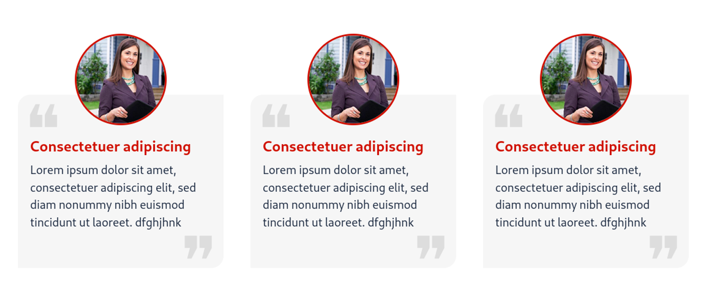

# Quote Card



## Código PHP / TWIG
```php showLineNumbers
<!-- User Quote With Profile Picture, Title & Description -->
<div class="user-quote">
    <div class="quote-photo">
        
    </div>
    <div class="quote-body">
        <h5 class="quote-title">
            Consectetuer adipiscing
        </h5>
        <p class="quote-description">
            Lorem ipsum dolor sit amet, consectetuer adipiscing elit, sed diam nonummy nibh euismod tincidunt ut laoreet. dfghjhnk
        </p>
    </div>
</div>
<!-- User Quote With Profile Picture, Title & Description -->
```


## Código SCSS
```scss
/* User Quote With Profile Picture, Title & Description */
.user-quote{
  padding: 10px;
  color: #1b2940 !important;

  .quote-photo{
    text-align: center;
    img{
      border-radius: 50%;
      border: 3px solid #d01000;
      width: 150px;
      height: 150px;
    }
  }

  .quote-body{
    background-color: #f6f6f6;
    border-radius: 20px 0px 20px 0px;
    padding: 20px;

    position: relative;
    top: -50px;
    z-index: -1;


    .quote-title{
      font-size: 1.5rem !important;
      margin: 10px 0px 10px 0px;
      font-weight: bold;
      color: #d01000;
      text-align: left;
      margin-top: 50px;
    }
    .quote-description{
      font-weight: normal !important;
      font-size: 1.2rem;
      text-align: left;
      padding-bottom: 10px;
      margin-bottom: 30px;
    }
  }

  .quote-body::after{
    content: "❝";
    position: absolute;
    z-index: 3;
    font-size: 7rem;
    left: 10px;
    top: -30px;
    color: rgba(0, 0, 0, 0.1);
  }

  .quote-body{
    .quote-description::before{
      content: "❞";
      position: absolute;
      z-index: 3;
      font-size: 7rem;
      color: rgba(0, 0, 0, 0.1);
      right: 10px;
      bottom: -70px;
    }
  }

}
/* User Quote With Profile Picture, Title & Description */
```