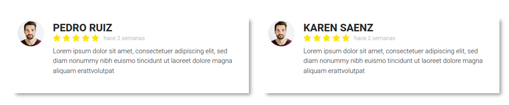

# Review Card




## Código PHP / TWIG
```php showLineNumbers
<div class="review-card">
    <div class="review_heading">
        <div class="review_picture"
            style="background-image: url('/assets/img/23.jpg');"
        ></div>
        <div class="review_heading_content">
            <div class="page-subtitle review_name">
                PEDRO RUIZ
            </div>
            <div class="review_subheading">
                <div class="review_rate">
                    <i class="fa-solid fa-star"></i>
                    <i class="fa-solid fa-star"></i>
                    <i class="fa-solid fa-star"></i>
                    <i class="fa-solid fa-star"></i>
                    <i class="fa-solid fa-star"></i>
                </div>
                <span class="review_time">
                    hace 2 semanas
                </span>
            </div>
        </div>
    </div>
    <p class="review_description">
        Lorem ipsum dolor sit amet, consectetuer adipiscing elit, sed diam nonummy nibh euismo tincidunt ut laoreet dolore magna aliquam erattvolutpat
    </p>
</div>
```


## Código SCSS
```scss showLineNumbers
// Review Card
.review-card{
  background-color: white;
  padding: 15px 20px 40px 20px;

  box-shadow: 10px 10px 8px -6px rgba(0,0,0,0.39);
  -moz-box-shadow: 10px 10px 8px -6px rgba(0,0,0,0.39);
  -webkit-box-shadow: 10px 10px 8px -6px rgba(0,0,0,0.39);

  .review_heading{
    display: flex;

    .review_picture{
      width: 60px;
      margin-right: 20px;

      aspect-ratio: 1 / 1;
      border-radius: 50%;

      background-size: cover;
      background-position: center;
    }
    
    .review_heading_content{
      display: flex;
      flex-direction: column;
      justify-content: center;

      .review_name{
        line-height: 1;
        font-weight: bolder;
      }
  
      .review_subheading{
        @media only screen and (min-width: 375px){
          display: flex;
        }
        .review_rate{
          margin-right: 10px;
          i{
            color: #ffe500;
          }
        }
        .review_time{
          font-size: 13px;
          color: rgba(0,0,0,0.4);

          line-height: 1;
          display: flex;
          align-items: center;
        }
      }
    }
  }
  .review_description{
    font-size: 15px;
    margin-bottom: 0;
    margin-left: 80px;
  }
}
```