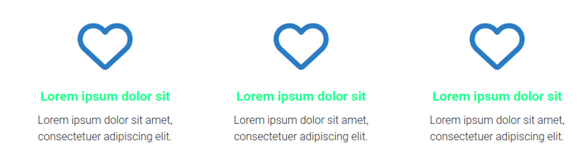

# Simple Icon



## Código PHP / TWIG
```php showLineNumbers
<div class="simple-icon-card">
    <i class="fa-regular fa-heart"></i>

    <p class="card-title title-line-top">
        Lorem ipsum dolor sit
    </p>
    <p class="card-description">
        Lorem ipsum dolor sit amet, consectetuer adipiscing elit.
    </p>
</div>
```


## Código SASS
```scss showLineNumbers
// Simple Icon Cards
.simple-icon-card{
  padding: 10px;
  margin:  20px 0px;
  text-align: center;
  i{
    font-size: 5rem;
    color: #2b7bc3;
    margin-bottom: 1.2rem;
  }
  .card-title{
    font-size: 1.2rem;
    color: #1eff8e;
    font-weight: bold;
  }

  &.white-card{
    i{
      color: red
    }
    .card-title,
    .card-description{
      color: white
    }
  }
}
```