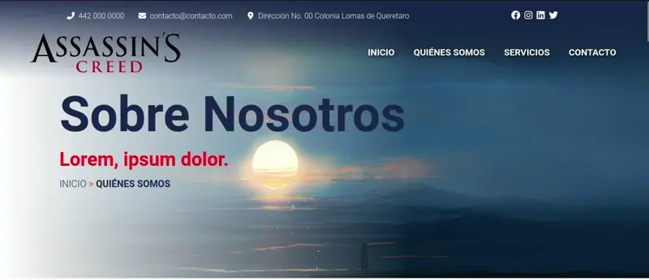

# Contact Bar



## Código PHP / TWIG
```php showLineNumbers
<section id="main-header" class="navigation">
      <div class="top-contact">
          <div class="container">
              <div class="row d-flex justify-content-between">
                  <div class="col-10 col-xl-8">
                      <ul class="fa-ul">
                          <li>
                              <span class="fa-li">
                                  <i class="fa-solid fa-phone-flip"></i>
                              </span>
                              <a href="tel:" target="_blank">
                                  442 000 0000
                              </a>
                          </li>

                          <li>
                              <span class="fa-li">
                                  <i class="fa-solid fa-envelope"></i>
                              </span>
                              <a href="mailto:" target="_blank">
                                  contacto@contacto.com
                              </a>
                          </li>

                          
                          <li>
                              <span class="fa-li">
                                  <i class="fa-solid fa-location-dot"></i>
                              </span>
                              <a href="#" target="_blank">
                                Dirección No. 00 Colonia Lomas de Queretaro
                              </a>
                          </li>
                      </ul>
                  </div>

                  <div class="col-2 top-social">
                      <a href="http://" target="_blank">
                          <i class="fa-brands fa-facebook"></i>
                      </a>
                      <a href="http://" target="_blank">
                          <i class="fa-brands fa-instagram"></i>
                      </a>
                      <a href="http://" target="_blank">
                          <i class="fa-brands fa-linkedin"></i>
                      </a>
                      <a href="http://" target="_blank">
                          <i class="fa-brands fa-twitter"></i>
                      </a>
                  </div>
              </div>
          </div>
      </div>

      <div class="nav-align">
        <div class="brand">
          <a href="/">
            
          </a>
        </div>

        <nav>
          <div class="nav-mobile">
            <a id="nav-toggle" href="#!"><span></span></a>
          </div>

          <ul class="nav-list">
            <li class="nav-item active" aria-current="inicio">
              <a class="nav-link" href="/">
                Inicio
              </a>
            </li>

            <li class="nav-item active" aria-current="nosotros">
              <a class="nav-link" href="/nosotros">
                Quiénes somos
              </a>
            </li>

            <li class="nav-item active" aria-current="servicios">
              <a class="nav-link" href="/servicios">
                Servicios
              </a>
            </li>

            <li class="nav-item active" aria-current="contacto">
              <a class="nav-link" href="/contacto">
                Contacto
              </a>
            </li>
          </ul>
        </nav>
      </div>
    </section>
```


## Código SCSS
```scss
.navigation{
    background: linear-gradient(0deg, rgba(255,255,255,0) 0%, rgba(26,39,77,0.9093837364047181) 100%);

    height: auto;
    background-color: transparent; /* NavBar BackGround Color */

    position: absolute;
    z-index: 900;
    width: 100%;

    .top-contact{
        .container{
          padding-top: 20px;
          padding-bottom: 10px;
    
          @media only screen and (max-width: 992px){
            max-width: 100%;
          }
          @media only screen and (max-width: 999px){
            display: none !important;
          }
        }
        ul{
          display: flex;
          margin-bottom: 0rem;
          justify-content: space-between;
        }
        a,
        li{
          color: white;
          text-decoration: none;
        }
        .top-social a{
          margin-right: 5px;
    
          i{
            font-size: 1.2rem;
          }
        }
    }

    .nav-align {
    /* NavBar Items Alignment */
        display: flex;
        justify-content: space-between;

        nav {
            display: flex;
            align-items: center;

            ul {
                list-style: none;
                margin: 0;
                padding: 0;
                text-align: center;

                li {
                    float: left;
                    position: relative;

                    a,
                    a:visited {
                        color: white !important; /* NavBar Mobile Links Color */
                        display: block;
                        padding: 0 20px;
                        text-decoration: none;
                        text-transform: uppercase;
                        font-weight: bolder;
                        font-size: 1.2rem;
                        text-shadow: 4px 3px 9px rgba(0, 0, 0, 0.73);

                        &::after{
                            content:"";
                            width: 100%;
                            height: 1px;
                            background-color: transparent;
                            display: block;
                        }
                    }

                    a:not(:only-child):after,
                    a:visited:not(:only-child):after {
                        padding-left: 4px;
                        content: " ▾";
                    }
                }
            }

            ul li ul li {
                min-width: 190px;
            }
            ul li ul li a {
                padding: 15px;
                line-height: 20px;
            }


            /* Mobile navigation */
            .nav-mobile {
                display: none;
                position: absolute;
                top: 0;
                right: 0;
                background: transparent;
                height: 70px;
                width: 70px;
            }
        }
    }


    // Mobile Navigation
    @media only screen and (max-width: 999px){
        top: 0px;
        height: 100px;
        background-color: #1A274D;

        position: fixed !important;

        .top-contact{
            display: none;
            transition: all 0.3s ease-out;
        }

        .nav-align {
            display: flex;
            justify-content: center !important;

            .brand {
                position: absolute;
                padding-top: 20px;
                margin-left: 0px !important;
                text-align: center;
                z-index: 999;
                
                max-width: 25%;
          
                @media only screen and (max-width: 999px){
                  max-width: 190px;
                }
                @media only screen and (max-width: 414px){
                  max-width: 150px;
                }
            }


            nav{
                width: 100%;
                padding: 100px 0 15px;

                .nav-mobile {
                    display: block;
                    a {
                      left: 0px !important;
                      top: 35px !important;
                    }
                }

                .nav-list{
                    width: 100%;
                    padding: 20px 0px;

                    display: none;
                    background-color: #1A274D;

                    .active{/* NavItem Active Class */
                        a{
                            background-color: #203478;
                        }
                    }

                    .nav-item{
                        float: none;
                        text-align: center;

                        a {
                            padding: 15px;
                            line-height: 20px;
                            color: royalblue;
                        }
                    }
                }

                ul li ul li a {
                    padding-left: 30px;
                }
            }
        }
    }

    // Desktop Navigation
    @media screen and (min-width: 1000px){
        position: fixed !important;

        &.nav-on-scroll {
            background-color: #1A274D; /* NavBar BackGround Color on Scroll */
            top: 0 !important;
        
            .top-contact{
              display: none;
              transition: all 0.3s ease-out;
            }
        
            .brand {
              img {
                max-width: 50%;
                transition: all 0.3s ease-out;
              }
            }
        }

        &, .nav-mobile{
            transition: all 0.5s ease-out;

            .nav-align{
                .brand {
                    padding: 10px;
                    width: 25%; /* NavBar Logo Width */
                    margin-left: 50px;
                  
                    img {
                        transition: all 0.3s ease-out;
                    }
                  }
    
                nav{
                    margin-right: 50px;
                    .nav-list{
                        display: contents !important;
                        .active { /* NavItem Active Class */
                            .nav-link::after{
                                content: "";
                                width: 100%;
                                height: 1px;
                                display: block;
                                background: #FF0019;
                            }
                        }
    
                        .nav-item{
                            transition: all 0.5s ease-out;
                            .nav-link,
                            .nav-link:visited {
                                background: transparent;

                                color: white !important; /* NavLink Color */
                                transition: all 0.5s ease-out;
                            }

                            a:hover,
                            a:visited:hover {
                                transition: all 0.5s ease-out;
                                &::after{
                                    content:"";
                                    width: 100%;
                                    height: 1px;
                                    background-color: #FF0019;
                                    display: block;
                                }
                            }

                            &:hover{
                                transition: all 0.5s ease-out;
                            }
                        }
                    }
                }
            }
        }
    }


    #nav-toggle {
        position: absolute;
        left: 18px;
        top: 22px;
        cursor: pointer;
        padding: 10px 35px 16px 0px;
    }
    #nav-toggle span,
    #nav-toggle span:before,
    #nav-toggle span:after {
        cursor: pointer;
        border-radius: 1px;
        height: 5px;
        width: 35px;
        background: white; /* NavMenu Button Color */
        position: absolute;
        display: block;
        content: "";
        transition: all 300ms ease-in-out;
    }
    #nav-toggle span:before {
        top: -10px;
    }
    #nav-toggle span:after {
        bottom: -10px;
    }
    #nav-toggle.active span {
        background-color: transparent;
    }
    #nav-toggle.active span:before,
    #nav-toggle.active span:after {
        top: 0;
    }
    #nav-toggle.active span:before {
        transform: rotate(45deg);
    }
    #nav-toggle.active span:after {
        transform: rotate(-45deg);
    }
}
```

## Código JS
```js showLineNumbers
function checkScroollMenu() {
    if ($(window).scrollTop() > 60) {
      // $('#main-header').addClass('fixed-top');
      $("#main-header").addClass("nav-on-scroll");
    } else {
      // $('#main-header').removeClass('fixed-top');
      $("#main-header").removeClass("nav-on-scroll");
    }
  }
  checkScroollMenu();
  
  $(window).scroll(function () {
    checkScroollMenu();
  });
  
  (function ($) {
    // Begin jQuery
    $(function () {
      // DOM ready
      // If a link has a dropdown, add sub menu toggle.
      $("nav ul li a:not(:only-child)").click(function (e) {
        $(this).siblings(".nav-dropdown").toggle();
        // Close one dropdown when selecting another
        $(".nav-dropdown").not($(this).siblings()).hide();
        e.stopPropagation();
      });
      // Clicking away from dropdown will remove the dropdown class
      $("html").click(function () {
        $(".nav-dropdown").hide();
      });
      // Toggle open and close nav styles on click
      $("#nav-toggle").click(function () {
        $("nav ul").slideToggle();
      });
      // Hamburger to X toggle
      $("#nav-toggle").on("click", function () {
        this.classList.toggle("active");
      });
    }); // end DOM ready
  })(jQuery); // end jQuery
```